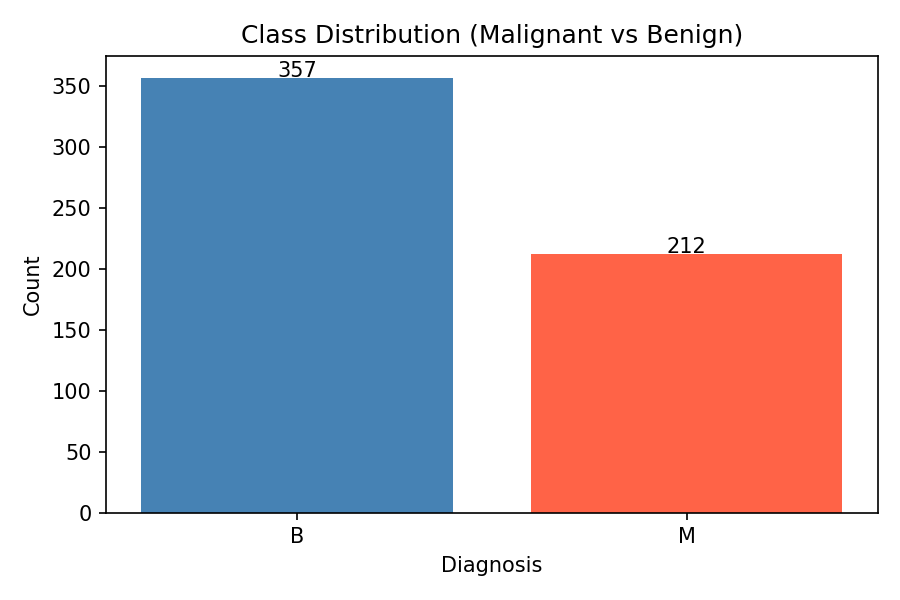
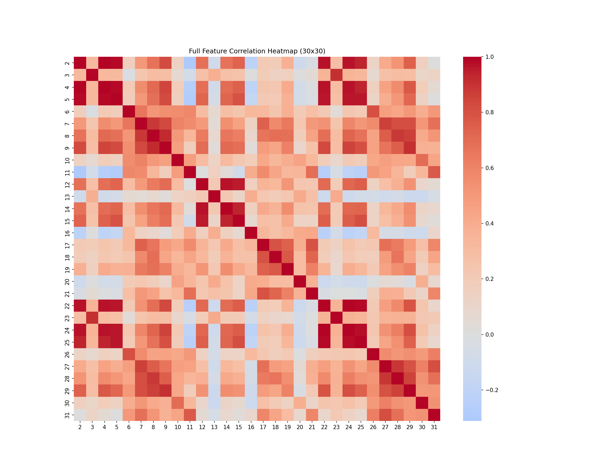
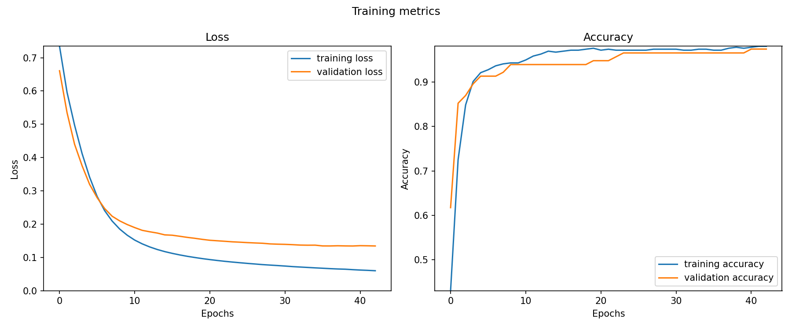
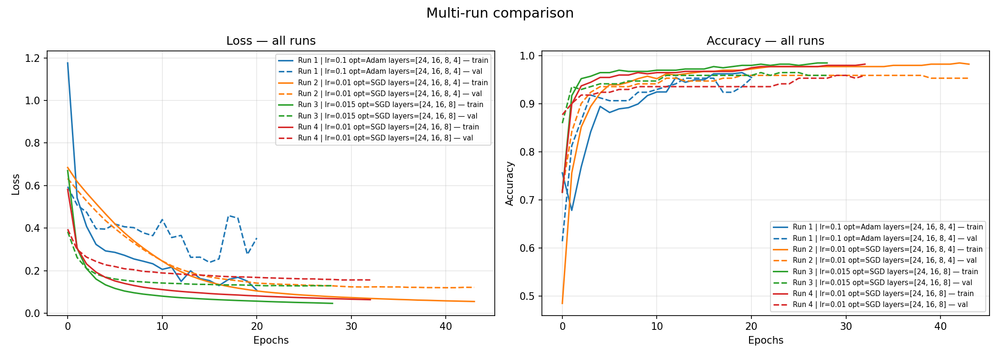
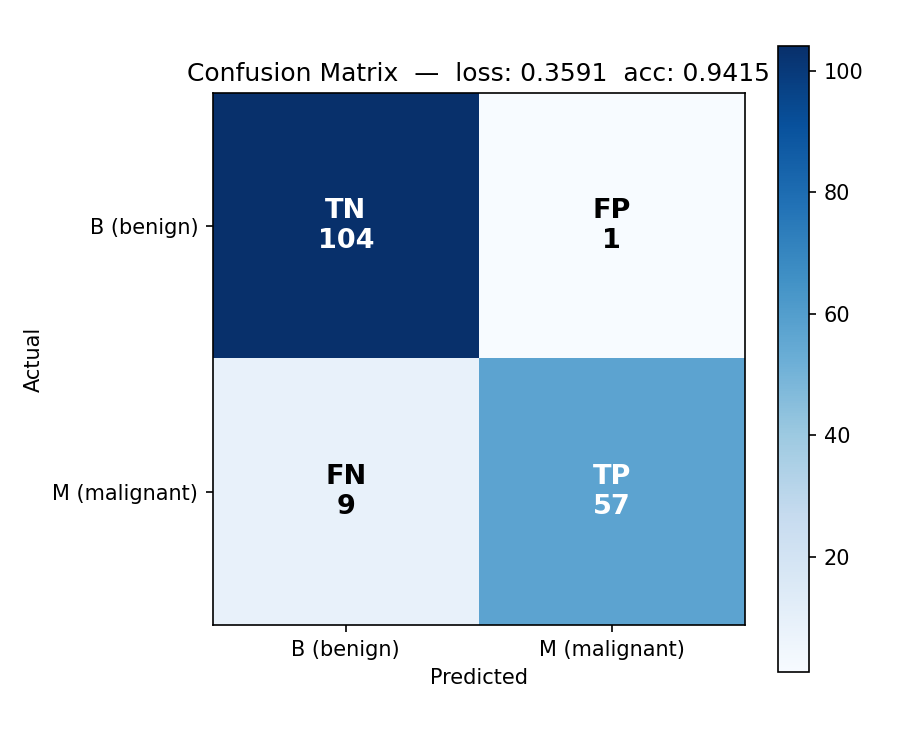

# Multilayer Perceptron — Breast Cancer Classification

A neural network built from scratch in Python, trained to classify breast cancer tumors as **Malignant (M)** or **Benign (B)** using the Wisconsin Breast Cancer dataset.

No neural network library is used — only NumPy for linear algebra and Matplotlib for visualization.

---

## Dataset

569 samples, 30 features, 2 classes. The dataset is moderately imbalanced: 252 benign vs 146 malignant in the training split.



Many features are strongly correlated (radius, perimeter, area), as seen in the full feature correlation heatmap:



---

## Architecture

```
Input (30 features)
    │
    ▼
Dense(30 → 24) + ReLU
    │
    ▼
Dense(24 → 10) + ReLU
    │
    ▼
Dense(10 → 8)  + ReLU
    │
    ▼
Dense(8  → 2)  + Softmax   ← training  (CCE loss)
                 Sigmoid    ← inference (BCE loss, fused from Softmax weights)
```

The default architecture uses **3 hidden layers**. It is fully configurable via `--layer`.

At inference time, the 2-output Softmax head is converted to a single logit using the identity `Softmax([a,b])[0] = Sigmoid(a−b)`, so no retraining is needed for inference.

---

## Files

```
├── data.csv                        # Raw dataset (569 samples, 32 columns)
├── main.py                         # Entry point: parse args, split dataset, save session.json
├── 1_load.py                       # Load & visualize dataset, save normalization stats
├── 2_configure.py                  # Display architecture and training config
├── 3_train.py                      # Build model, run training loop, save export.json
├── 4_predict.py                    # Load export.json, run inference, show confusion matrix
│
├── src/
│   ├── layers.py                   # Dense, ReLU, Softmax
│   ├── loss_functions.py           # BinaryCrossEntropy, CategoricalCrossEntropy
│   ├── neural_network.py           # NeuralNetMLP: forward, backward, training loop, inference
│   └── optimizers.py               # SGD, Adam
│
├── tools/
│   ├── utils.py                    # Dataset loading, normalization, split, session helpers
│   ├── visualize_dataset.py        # Class distribution and correlation heatmap plots
│   └── visualize_graphs.py         # Training curve plots
│
└── generated/                      # Created at runtime
    ├── session.json                # Training configuration saved by main.py
    ├── train_set.csv               # Auto-split training set
    ├── validation_set.csv          # Auto-split validation set
    ├── export.json                 # Trained weights + topology
    └── norm_stats.json             # Mean/std used for normalization
```

---

## Setup

```bash
python3 -m venv .venv
source .venv/bin/activate
pip install -r requirements.txt
```

---

## Usage

Run `main.py` first to configure the session, then run each numbered step in order.

### Step 0 — Configure

```bash
python3 main.py data.csv
python3 main.py data.csv --epochs 100 --batch_size 32 --learning_rate 0.005 --layer 24 16 8 --adam
```

Parses arguments, splits `data.csv` into train/validation sets, and saves `generated/session.json`.

| Argument | Default | Description |
|----------|---------|-------------|
| `--split` | 0.2 | Validation ratio for auto-split |
| `--epochs` | 70 | Number of training epochs |
| `--batch_size` | 16 | Samples per gradient update |
| `--learning_rate` | 0.01 | Step size for weight updates |
| `--layer N [N ...]` | `24 10 8` | Hidden layer sizes |
| `--patience` | 3 | Early stopping patience |
| `--adam` | off | Use Adam optimizer instead of SGD |

---

### Step 1 — Load & Visualize

```bash
python3 1_load.py
```

Loads train/validation CSVs, applies z-score normalization, saves `norm_stats.json`, and plots dataset visualizations.

---

### Step 2 — Review Configuration

```bash
python3 2_configure.py
```

Displays the layer architecture and training hyperparameters that will be used. No computation — display only.

---

### Step 3 — Train

```bash
python3 3_train.py
```

Builds the network, runs mini-batch training with backpropagation, and saves weights to `generated/export.json`. Each run's history is appended to `generated/histories.json`.

Loss and accuracy converge quickly — training typically stops early via patience:



Run `5_compare.py` (if available) to overlay curves from multiple runs and compare hyperparameter choices:



---

### Step 4 — Predict

```bash
python3 4_predict.py
python3 4_predict.py generated/export_run2.json   # use a specific run
```

Loads `export.json`, fuses the Softmax head into a single sigmoid logit, runs inference on the validation set, and displays a confusion matrix.

**Result — loss: 0.3591 | accuracy: 94.15%**



- **TN 104** — correctly predicted Benign
- **TP 57** — correctly predicted Malignant
- **FP 1** — predicted Malignant, actually Benign (false alarm)
- **FN 9** — predicted Benign, actually Malignant (missed cancer — the critical error to minimize)

---

## How It Works

### Forward Propagation

Input flows through each layer sequentially:

```
output = activation(input @ W + b)
```

Each Dense layer caches its input for use during the backward pass.

### Backpropagation

Gradients flow from the loss backward through each layer via the chain rule:

- **Output layer (fused gradient):** for Softmax+CCE the delta simplifies to `δ = (ŷ − y) / batch_size`
- **Hidden layers:** `δ_prev = δ @ W.T`, then `dW = input.T @ δ`, `db = sum(δ, axis=0)`

### Weight Initialization

Dense layers use **He uniform** initialization:

```
limit = sqrt(6 / n_in)
W ~ Uniform(−limit, +limit)
```

### Optimizers

**SGD:**
```
W = W − lr * dW
b = b − lr * db
```

**Adam:** gradients are scaled by their running first and second moments with bias correction, giving adaptive per-parameter learning rates.

### Early Stopping

Training halts when validation loss does not improve for `--patience` consecutive epochs, preventing overfitting.
